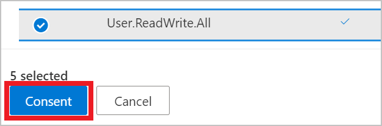
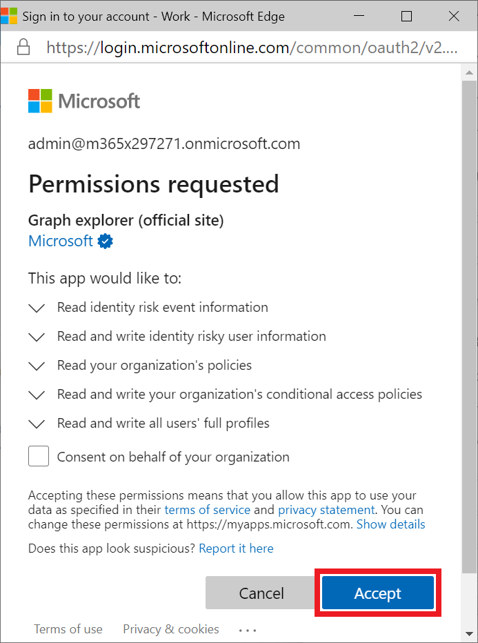
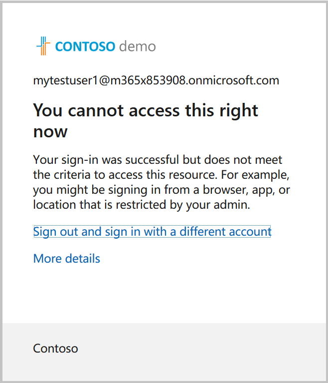

# Tutorial: Identify and remediate risks using Microsoft Graph APIs

Risk detections in Azure AD Identity Protection include any identified suspicious actions related to user accounts in the directory. Identity Protection provides organizations access to powerful resources to see and respond quickly to suspicious actions. For more information, see [What is risk?](/azure/active-directory/identity-protection/concept-identity-protection-risks)

In this tutorial, you accomplish these tasks:
- Create a user account to test risk detection
- Trigger a risk event by signing in anonymously
- List risk events
- Create a conditional access policy that is used to remidiate risks
- Remidiate risk by dismissing the risky user

>**Note:** The response objects shown in this tutorial might be shortened for readability. 

## Prerequisites

To successfully complete this tutorial, make sure that you have the required prerequisites:

- You must have an Azure AD Premium P1 or P2 license to use the risk detection API.
- This tutorial uses the Tor browser to sign in to the Azure portal anonymously. You can use any anonymous browser to accomplish the task. To download the Tor browser, see [Download Tor Browser](https://www.torproject.org/download/).
- This tutorial assumes that you are using Microsoft Graph Explorer, but you can use Postman, or create your own client app to call Microsoft Graph. To call the Microsoft Graph APIs in this tutorial, you need to use an account with the global administrator role and the appropriate permissions. Complete the following steps to set permissions in Microsoft Graph Explorer:
    1. Start [Microsoft Graph Explorer](https://developer.microsoft.com/graph/graph-explorer).
    2. Select **Sign-In with Microsoft** and sign in using an Azure AD global administrator account. After you successfully sign in, you can see the user account details in the left-hand pane.
    3. Select the settings icon to the right of the user account details, and then select **Select permissions**.

        
        
    4. Scroll through the list of permissions to these permissions:
        - **IdentityRiskEvents (2)**, and then select `IdentityRiskEvent.Read.All`
        - **IdentityRiskyUser (2)**, and then select `IdentityRiskyUser.ReadWrite.All`
        - **Policy (13)**, and then select `Policy.Read.All` and `Policy.ReadWrite.ConditionalAccess`
        - **User (8)**, and then select `User.ReadWrite.All`
        
        
    
    5. Select **Consent**, and then select **Accept** to accept the consent of the permissions. You do not need to consent on behalf of your organization for these permissions.

        

## Step 1: Create a user account

For this tutorial, you create a user account that is used to test risk events. In the request body, change `contoso.onmicrosoft.com` to the domain name of your tenant. You can find tenant information on the Azure Active Directory overview page.

### Request

``` http
POST https://graph.microsoft.com/v1.0/users
Content-type: application/json

{
  "accountEnabled":true,
  "displayName":"MyTestUser1",
  "mailNickname":"MyTestUser1",
  "userPrincipalName":"MyTestUser1@contoso.onmicrosoft.com",
  "passwordProfile": {
    "forceChangePasswordNextSignIn":true,
    "password":"Contoso1234"
  }
}
```

### Response

```http
{
  "@odata.context": "https://graph.microsoft.com/v1.0/$metadata#users/$entity",
  "id": "4628e7df-dff3-407c-a08f-75f08c0806dc",
  "businessPhones": [],
  "displayName": "MyTestUser1",
  "givenName": null,
  "jobTitle": null,
  "mail": null,
  "mobilePhone": null,
  "officeLocation": null,
  "preferredLanguage": null,
  "surname": null,
  "userPrincipalName": "MyTestUser1@contoso.onmicrosoft.com"
}
```

## Step 2: Trigger an event and list risk detections

### Trigger an event

One way to trigger a risk detection on a user account is to sign in to the Azure portal anonymously. In this tutorial, the Tor browser is used to sign in anonymously. 

1. Open the browser and enter `portal.azure.com` for the site address.
2. Sign in to the portal using the credentials for the **MyTestUser1** account that you previously created. You will be asked to change the existing password.

### List risk detections

When you signed in to the Azure portal using the anonymous browser, an `anonymizedIPAddress` risk event was detected.

#### Request

``` http
GET https://graph.microsoft.com/beta/identityProtection/riskDetections?$filter=userDisplayName eq 'MyTestUser1'
```

#### Response

```http
{
  "@odata.context": "https://graph.microsoft.com/beta/$metadata#riskDetections",
  "value": [
    {
      "id": "d52a631815aaa527bf642b196715da5cf0f35b6879204ea5b5c99b21bd4c16f4",
      "requestId": "06f7fd18-b8f1-407d-86a3-f6cbe3a4be00",
      "correlationId": "2a38abff-5701-4073-a81e-fd3aac09cba3",
      "riskType": "anonymizedIPAddress",
      "riskEventType": "anonymizedIPAddress",
      "riskState": "atRisk",
      "riskLevel": "medium",
      "riskDetail": "none",
      "source": "IdentityProtection",
      "detectionTimingType": "realtime",
      "activity": "signin",
      "tokenIssuerType": "AzureAD",
      "ipAddress": "178.17.170.23",
      "activityDateTime": "2020-11-03T20:51:34.6245276Z",
      "detectedDateTime": "2020-11-03T20:51:34.6245276Z",
      "lastUpdatedDateTime": "2020-11-03T20:53:12.1984203Z",
      "userId": "4628e7df-dff3-407c-a08f-75f08c0806dc",
      "userDisplayName": "MyTestUser1",
      "userPrincipalName": "MyTestUser1@M365x853908.onmicrosoft.com",
      "additionalInfo": "[{\"Key\":\"userAgent\",\"Value\":\"Mozilla/5.0 (Windows NT 10.0; rv:78.0) Gecko/20100101 Firefox/78.0\"}]",
      "location": {
        "city": "Chisinau",
        "state": "Chisinau",
        "countryOrRegion": "MD",
        "geoCoordinates": {
          "latitude": 47.0269,
          "longitude": 28.8416
        }
      }
    }
  ]
}
```

> **Note:** It may take a few minutes for the event to be returned.

## Step 3: Create a conditional access policy

Most users have a normal behavior that can be tracked, when they fall outside of this norm it could be risky to allow them to just sign in. You may want to block that user or maybe just ask them to perform multi-factor authentication to prove that they are really who they say they are. 

The conditional access policy resource in Microsoft Graph provides the ability to set the conditions of the policy to identify sign-in risk levels. Risk levels can be `low`, `medium`, `high`, `none`. In the response that was returned from listing the risk detections for **MyTestUser1**, we can see that the risk level is `medium`.

### Request

```http
POST https://graph.microsoft.com/v1.0/identity/conditionalAccess/policies
Content-type: application/json

{
  "displayName": "Policy for risky sign-in",
  "state": "enabled",
  "conditions": {
    "signInRiskLevels": [
      "high",
      "medium"
    ],
    "applications": {
      "includeApplications": ["All"]
    },
    "users": {
      "includeUsers": [
        "4628e7df-dff3-407c-a08f-75f08c0806dc"
      ]
    }
  },
  "grantControls": {
    "operator": "OR",
    "builtInControls": [
      "block"
    ]
  }
}
```

### Response

```http
{
  "@odata.context": "https://graph.microsoft.com/v1.0/$metadata#identity/conditionalAccess/policies/$entity",
  "id": "9ad78153-b1f8-4714-adc1-1445727678a8",
  "displayName": "Policy for risky sign-in",
  "createdDateTime": "2020-11-03T20:56:38.6210843Z",
  "modifiedDateTime": null,
  "state": "enabled",
  "sessionControls": null,
  "conditions": {
    "signInRiskLevels": [
      "high",
      "medium"
    ],
    "clientAppTypes": [ 
      "all" 
    ],
    "platforms": null,
    "locations": null,
    "applications": {
      "includeApplications": [
        "All"
      ],
      "excludeApplications": [],
      "includeUserActions": []
    },
    "users": {
      "includeUsers": [
        "4628e7df-dff3-407c-a08f-75f08c0806dc"
      ],
      "excludeUsers": [],
      "includeGroups": [],
      "excludeGroups": [],
      "includeRoles": [],
      "excludeRoles": []
    }
  },
  "grantControls": {
    "operator": "OR",
    "builtInControls": [
      "block"
    ],
    "customAuthenticationFactors": [],
    "termsOfUse": []
  }
}
```

With this conditional access policy in place, the **MyTestUser1** account is now blocked from signing in because the sign-in risk level is `medium` or higher.



## Step 4: Dismiss risky users

### List risky users

#### Request

```http
GET https://graph.microsoft.com/beta/riskyUsers?$filter=userDisplayName eq 'MyTestUser1'
```

#### Response

```http
{
  "@odata.context": "https://graph.microsoft.com/beta/$metadata#riskyUsers",
  "value": [
    {
      "id": "4628e7df-dff3-407c-a08f-75f08c0806dc",
      "isDeleted": false,
      "isProcessing": false,
      "riskLevel": "none",
      "riskState": "dismissed",
      "riskDetail": "adminDismissedAllRiskForUser",
      "riskLastUpdatedDateTime": "2020-11-03T21:48:53.4298425Z",
      "userDisplayName": "MyTestUser1",
      "userPrincipalName": "MyTestUser1@M365x853908.onmicrosoft.com"
    }
  ]
}
```

### Dismiss the risky user

#### Request

```http
POST https://graph.microsoft.com/v1.0/identityProtection/riskyUsers/dismiss
Content-Type: application/json

{
  "userIds": [
    "4628e7df-dff3-407c-a08f-75f08c0806dc"
  ]
}
```

#### Response

```http
HTTP/1.1 204 No Content
```

## Step 5: Clean up resources

In this step, you remove the resources that you created.

### Delete the user account

Delete the **MyTestUser1** user account.

#### Request

```http
DELETE https://graph.microsoft.com/v1.0/users/4628e7df-dff3-407c-a08f-75f08c0806dc
```

#### Response

```http
No Content - 204
```

### Delete the conditional access policy

Delete the conditional access policy that you created.

#### Request

```http
DELETE https://graph.microsoft.com/v1.0/groups/9ad78153-b1f8-4714-adc1-1445727678a8
```

#### Response

```http
No Content - 204
```

## See also

In this tutorial, you used many APIs to accomplish tasks. Explore the API reference for these APIs to learn more about what the APIs can do.

- [What is Identity Protection?](/azure/active-directory/identity-protection/overview-identity-protection)
- [What is Conditional Access?](/azure/active-directory/conditional-access/overview)
- [conditionalAccessPolicy](/graph/api/resources/conditionalaccesspolicy?view=graph-rest-1.0)
- [riskDetection](/graph/api/resources/riskdetection?view=graph-rest-1.0)
- [riskyUser](/graph/api/resources/riskyuser?view=graph-rest-1.0)
- [user](/graph/api/resources/user?view=graph-rest-1.0)